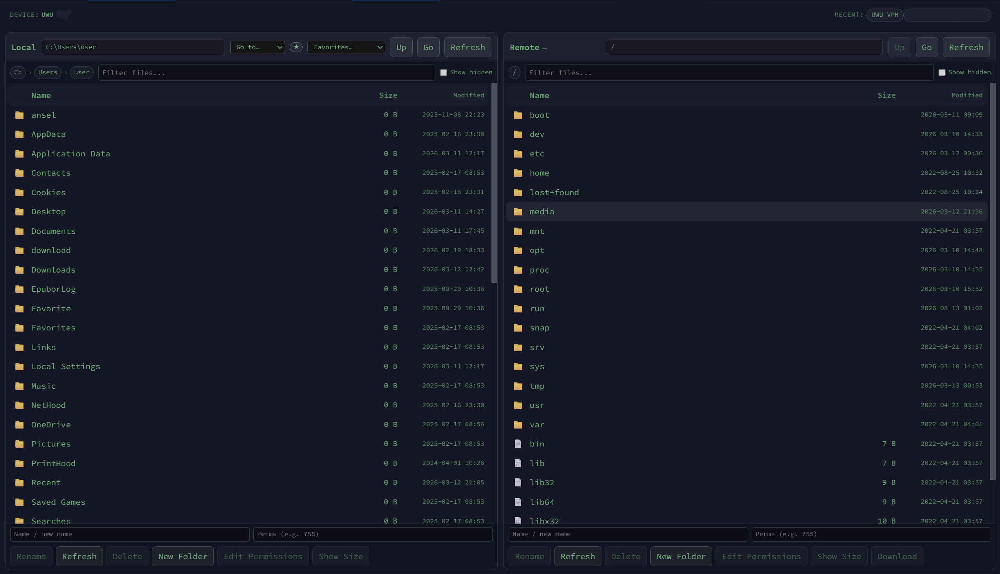

## Tabby SFTP UI Plugin



This plugin adds a **Termius‑style two‑pane SFTP file manager** to [Tabby](https://tabby.sh).
It integrates directly with your existing SSH tabs and uses Tabby's native SFTP backend.

If you find this useful, please **star the repo**: [growingupfirst/tabby-sftp-ui](https://github.com/growingupfirst/tabby-sftp-ui)

### Features

- **SFTP‑UI button in terminal toolbar** – opens the SFTP manager for the active SSH session.
- **Two panes** – local filesystem on the left, remote on the right.
- **Drag & drop**:
  - Between local and remote for uploads/downloads.
  - Within local pane and within remote pane for moves/renames.
  - From OS file manager into the remote pane for uploads.
- **Transfer queue** – visual list of active transfers with progress and cancel button.
- **Navigation & UX**:
  - Clickable folders, `Up` buttons, breadcrumb navigation.
  - Manual path input for local and remote.
  - Filtering by name, sortable columns (Name / Size / Modified).
  - Dynamic size and speed units (B / KB / MB / GB).
  - Optional "Show hidden" toggle for both panes.
  - Multi‑select with Ctrl/Cmd and Shift.
- **File operations**:
  - Rename, Delete (with in‑UI confirmation dialog), New Folder, Refresh.
  - Edit permissions (chmod style input).
  - On‑demand folder size calculation via context action.
- **Remote file editing**:
  - Double‑click a remote file to download it to a temp location, open with system default app,
    and automatically upload changes back to the remote when you save.
- **Local convenience features**:
  - Quick path presets (Home, Desktop, Documents, Downloads).
  - Favorite local paths stored in `localStorage`.
  - Interactive breadcrumbs with context menu to switch between sibling folders/drives.
- **Profiles integration**:
  - Top bar shows current SSH profile and recent profiles.
  - Clicking a recent profile opens a new SSH terminal tab.
- **Safe recovery behavior**:
  - SFTP tabs are **not** persisted across Tabby restarts (no stale/blank SFTP tabs).

### Requirements

- Tabby desktop (tested around `1.0.163`).
- Node.js and npm installed on your system.

### Install

#### From Tabby Plugin Manager (planned)

Once published to the official registry:

1. Open **Settings → Plugins** in Tabby.
2. Search for **“tabby-sftp-ui”**.
3. Click **Install**, then restart Tabby.

#### Manual install (current)

1. Clone this repository:

```bash
git clone https://github.com/growingupfirst/tabby-sftp-ui
cd tabby-sftp-ui
```

2. Install dependencies:

```bash
npm install
```

3. Build the plugin:

```bash
npm run build
```

4. Install the built plugin into Tabby’s plugins directory:

```bash
# Windows
cd "%APPDATA%\tabby\plugins"
npm install "<path-to>/tabby-sftp-ui" --legacy-peer-deps

# macOS / Linux
cd ~/.config/tabby/plugins
npm install "/absolute/path/to/tabby-sftp-ui" --legacy-peer-deps
```

5. **Restart Tabby completely** (close all windows and start again).

### Usage

1. Open an SSH session in Tabby.
2. In the session toolbar, click the **SFTP‑UI** button (next to Reconnect).
3. A new tab titled `<session name> + SFTP` will appear with the two‑pane file manager.
4. Use drag & drop, context actions, and the action bar to manage files.

### Development

- Main plugin module: `src/index.ts`
- Core UI component: `src/sftp-manager-tab.component.ts`
- SFTP backend wrapper: `src/sftp.service.ts`
- Local file transfer adapters: `src/local-transfers.ts`
- SFTP‑UI tab launcher/service: `src/sftp-ui.service.ts`

To rebuild after changes:

```bash
npm run build

# Reinstall into Tabby plugin directory (see paths above)
cd "%APPDATA%\tabby\plugins"   # or ~/.config/tabby/plugins
npm install "<path-to>/tabby-sftp-ui" --legacy-peer-deps
```

Then restart Tabby.

### Roadmap

- Better integration with Tabby’s plugin manager (one‑click install and updates).
- More granular progress details for large folder transfers.
- Optional inline file editor for small text files.
- Configurable keyboard shortcuts for common actions.

### Changelog

- **0.2.0**
  - UI: removed the main toolbar SFTP icon next to Settings (terminal button remains).
- **0.1.0**
  - Initial release.

### Problems
 - When reopening Tabby, the SFTP UI tabs are blank. Please contact me in [Telegram](https://t.me/Gr0w1ngUp) if you know how to fix this.

